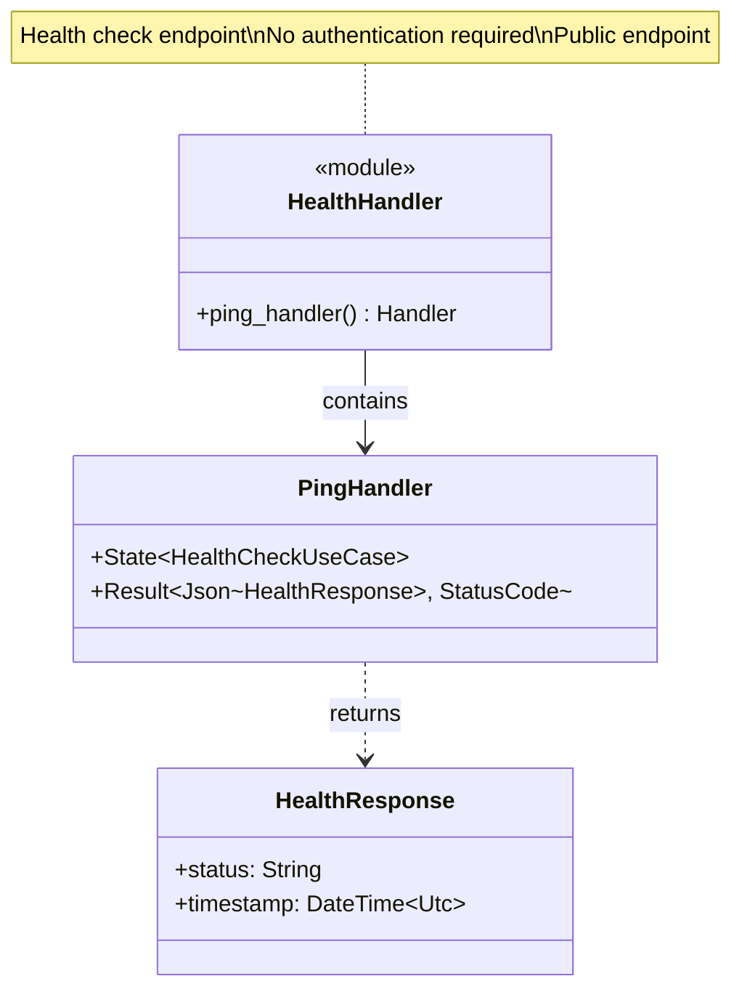
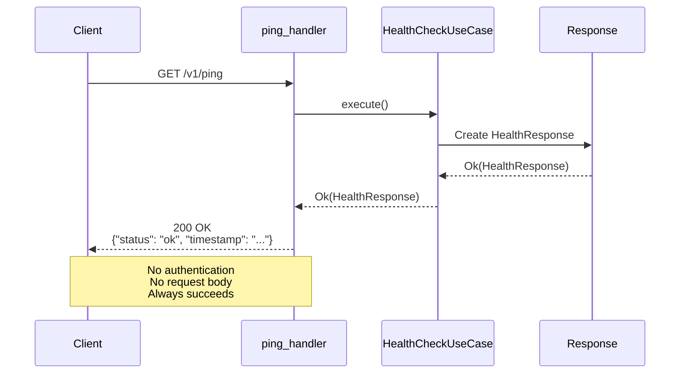
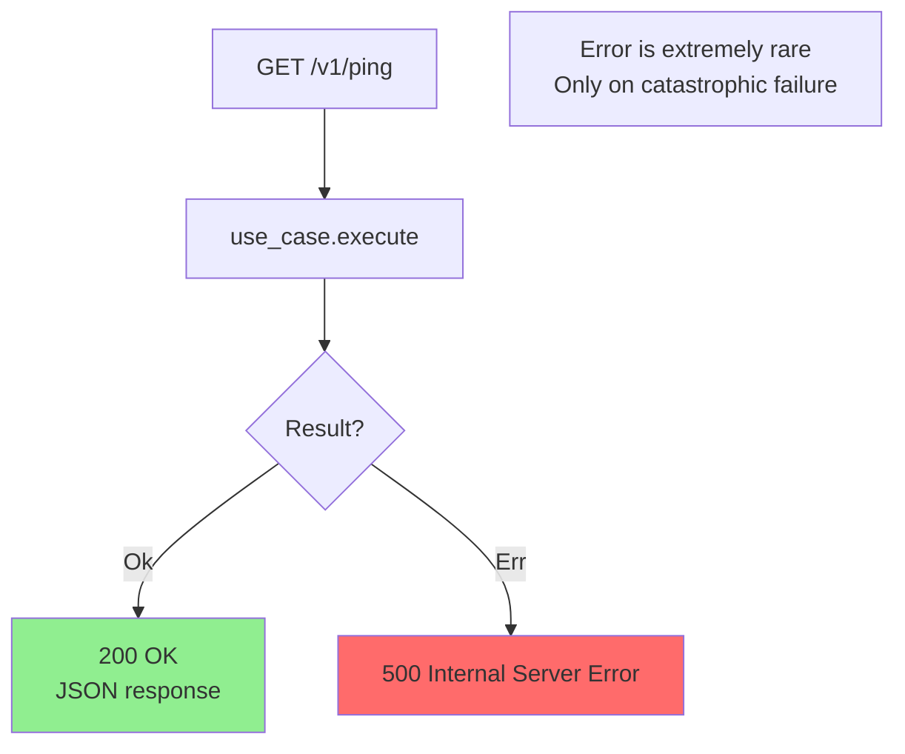
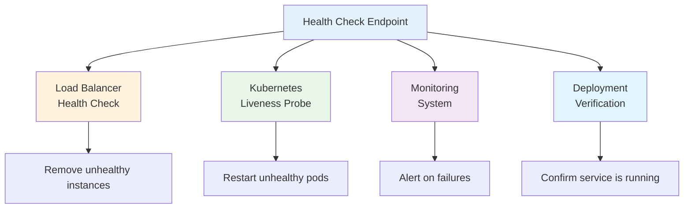

# Health Handler Class Diagram

## Overview

HTTP handler for the health check endpoint (`GET /v1/ping`), providing liveness check for load balancers and monitoring.

## Class Diagram



## Handler Signature

```rust
pub async fn ping_handler(
    State(use_case): State<Arc<HealthCheckUseCase>>,
) -> Result<Json<HealthResponse>, StatusCode>
```

## Request Flow



## Request Example

```http
GET /v1/ping HTTP/1.1
Host: api.example.com
```

## Response Example

```http
HTTP/1.1 200 OK
Content-Type: application/json

{
  "status": "ok",
  "timestamp": "2024-02-11T14:30:00Z"
}
```

## Handler Implementation

```rust
pub async fn ping_handler(
    State(use_case): State<Arc<HealthCheckUseCase>>,
) -> Result<Json<HealthResponse>, StatusCode> {
    use_case
        .execute()
        .map(Json)
        .map_err(|_| StatusCode::INTERNAL_SERVER_ERROR)
}
```

## Response Codes



| HTTP Status | Condition | Response Body |
|-------------|-----------|---------------|
| 200 OK | Always (normal operation) | `{"status": "ok", "timestamp": "..."}` |
| 500 Internal Server Error | Catastrophic failure (extremely rare) | Empty or error message |

## Use Cases



## Configuration Examples

### Kubernetes Liveness Probe

```yaml
livenessProbe:
  httpGet:
    path: /v1/ping
    port: 8080
  initialDelaySeconds: 10
  periodSeconds: 10
  timeoutSeconds: 2
  failureThreshold: 3
```

### Load Balancer Health Check (AWS ALB)

```yaml
HealthCheckPath: /v1/ping
HealthCheckProtocol: HTTP
HealthCheckIntervalSeconds: 30
HealthCheckTimeoutSeconds: 5
HealthyThresholdCount: 2
UnhealthyThresholdCount: 3
```

### Docker Compose Health Check

```yaml
healthcheck:
  test: ["CMD", "curl", "-f", "http://localhost:8080/v1/ping"]
  interval: 30s
  timeout: 3s
  retries: 3
  start_period: 40s
```

## Performance Characteristics

| Metric | Value | Notes |
|--------|-------|-------|
| **Response Time** | < 1ms | No I/O, pure computation |
| **CPU Usage** | Negligible | Simple timestamp generation |
| **Memory Usage** | < 1KB | Minimal allocation |
| **Throughput** | > 100,000 req/s | Can handle high load balancer polling |

## Testing

```rust
#[tokio::test]
async fn test_ping_success() {
    let app = create_test_app();
    
    let response = app
        .get("/v1/ping")
        .send()
        .await;
    
    assert_eq!(response.status(), StatusCode::OK);
    
    let json: HealthResponse = response.json().await;
    assert_eq!(json.status, "ok");
    assert!(json.timestamp <= Utc::now());
}

#[tokio::test]
async fn test_ping_no_auth_required() {
    let app = create_test_app();
    
    // No Authorization header
    let response = app
        .get("/v1/ping")
        .send()
        .await;
    
    // Should succeed without authentication
    assert_eq!(response.status(), StatusCode::OK);
}

#[tokio::test]
async fn test_ping_timestamp_freshness() {
    let app = create_test_app();
    
    let before = Utc::now();
    
    let response = app
        .get("/v1/ping")
        .send()
        .await;
    
    let after = Utc::now();
    let json: HealthResponse = response.json().await;
    
    assert!(json.timestamp >= before);
    assert!(json.timestamp <= after);
}
```

## Monitoring Integration

### Prometheus Metrics

```rust
// Increment counter on each health check
pub async fn ping_handler(
    State(use_case): State<Arc<HealthCheckUseCase>>,
) -> Result<Json<HealthResponse>, StatusCode> {
    HEALTH_CHECK_REQUESTS_TOTAL.inc();
    
    use_case
        .execute()
        .map(Json)
        .map_err(|_| {
            HEALTH_CHECK_FAILURES_TOTAL.inc();
            StatusCode::INTERNAL_SERVER_ERROR
        })
}
```

### Grafana Dashboard Query

```promql
# Success rate
rate(health_check_requests_total[5m]) - rate(health_check_failures_total[5m])

# Failure rate
rate(health_check_failures_total[5m])

# Response time (if instrumented)
histogram_quantile(0.99, health_check_duration_seconds_bucket[5m])
```

## Comparison: Liveness vs Readiness

| Aspect | Liveness (`/v1/ping`) | Readiness (not implemented) |
|--------|----------------------|----------------------------|
| **Purpose** | Is process alive? | Is service ready to handle traffic? |
| **Dependencies** | None | Database, external services |
| **Speed** | < 1ms | Variable (seconds) |
| **Failure Action** | Restart instance | Remove from load balancer |
| **Authentication** | No | Usually yes |
| **Use Case** | Process health | Service health |

## Design Rationale

- **Simplicity**: No dependencies = no failure modes
- **Fast**: Immediate response for high-frequency polling
- **Public**: No authentication required (safe, no sensitive data)
- **Standard**: Follows common health check patterns
- **Reliable**: Always succeeds unless catastrophic failure
- **Observable**: Easy to monitor and alert on failures
- **Kubernetes-Ready**: Perfect for liveness probes

## Future Enhancement: Readiness Check

For production readiness, consider adding a `/v1/ready` endpoint:

```rust
pub async fn ready_handler(
    State(repository): State<Arc<dyn MagicRepository>>,
    State(auth_service): State<Arc<dyn AuthenticationService>>,
) -> Result<Json<ReadinessResponse>, StatusCode> {
    // Check dependencies
    let checks = vec![
        check_repository(&repository).await,
        check_auth_service(&auth_service).await,
        check_filesystem().await,
    ];
    
    let all_healthy = checks.iter().all(|c| c.healthy);
    let status = if all_healthy { "ready" } else { "not_ready" };
    
    Ok(Json(ReadinessResponse {
        status: status.to_string(),
        checks,
        timestamp: Utc::now(),
    }))
}
```

| Check | Purpose | Healthy Criteria |
|-------|---------|------------------|
| **Repository** | libmagic available | Can analyze test data |
| **Auth Service** | Credentials configured | Can verify test credentials |
| **Filesystem** | Sandbox accessible | Can read/write temp files |
| **Database** | (If added) Connection alive | Can execute test query |
