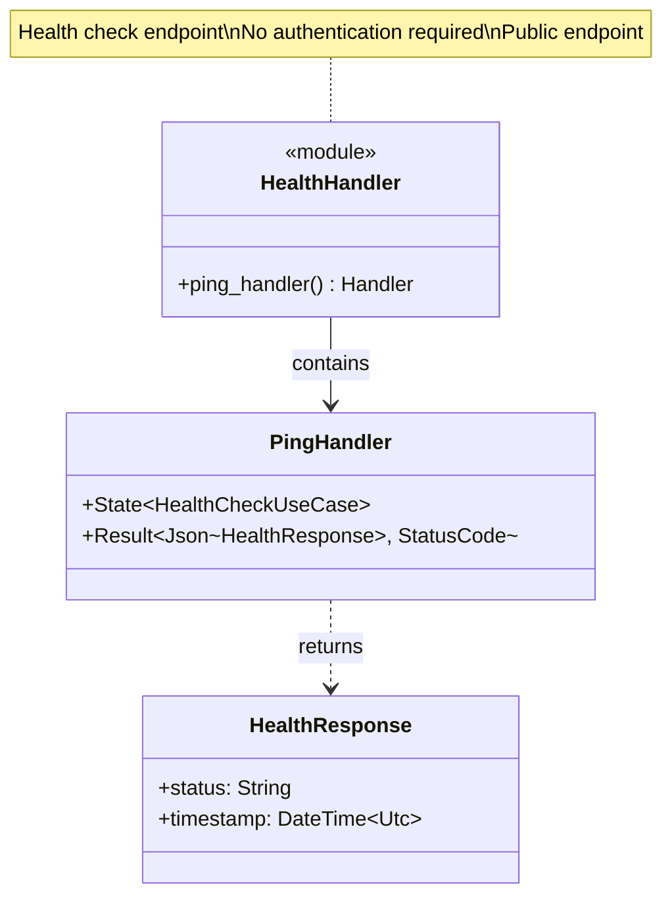

# Health Handler Class Diagram <!-- omit in toc -->

- [Overview](#overview)
- [Class Diagram](#class-diagram)
- [Handler Signature and Flow](#handler-signature-and-flow)
- [Response Codes and Examples](#response-codes-and-examples)
- [Integration Scenarios](#integration-scenarios)
- [Performance Characteristics](#performance-characteristics)
- [Testing Strategy](#testing-strategy)
- [Comparison: Liveness vs Readiness](#comparison-liveness-vs-readiness)
- [Design Rationale](#design-rationale)
- [Future Enhancement: Readiness Check](#future-enhancement-readiness-check)

---

## Overview

HTTP handler for the health check endpoint (`GET /v1/ping`), providing liveness check for load balancers and monitoring.

## Class Diagram



## Handler Signature and Flow

The ping handler is an asynchronous function that receives the health check use case through the application state. It executes the use case and returns a JSON response containing the system status and current timestamp. This endpoint is public and does not require authentication, making it ideal for high-frequency polling by load balancers and monitoring agents.

## Response Codes and Examples

The health check endpoint is designed for maximum availability and reliability. 

| HTTP Status | Condition |
|-------------|-----------|
| 200 OK | Normal operation - system is responding |
| 500 Internal Error | Catastrophic failure - process is unresponsive |

A successful response includes:
- **Status**: A string confirming the service is "ok".
- **Timestamp**: The current UTC time of the check.

## Integration Scenarios

The health check handler facilitates integration with various infrastructure components:
- **Load Balancers**: Used to determine if an instance should receive traffic.
- **Orchestrators**: Provides a liveness probe for Kubernetes to restart unhealthy containers.
- **Monitoring**: Enables dashboards to track uptime and responsiveness.
- **CI/CD**: Allows deployment scripts to verify the service started successfully.

## Performance Characteristics

The handler is highly optimized for performance:
- **Latency**: Typically responds in under 1 millisecond as it involves no I/O operations.
- **Resource Usage**: Extremely low CPU and memory footprint.
- **Throughput**: Capable of handling tens of thousands of requests per second on standard hardware.

## Testing Strategy

The health check is verified through simple integration tests:
- **Success Verification**: Confirms that a GET request returns 200 OK.
- **Unauthenticated Access**: Ensures that no Authorization header is required.
- **Data Freshness**: Validates that the returned timestamp is recent and correctly formatted.

## Comparison: Liveness vs Readiness

| Aspect | Liveness (`/v1/ping`) | Readiness (not implemented) |
|--------|----------------------|----------------------------|
| **Purpose** | Is process alive? | Is service ready to handle traffic? |
| **Dependencies** | None | Database, external services |
| **Speed** | < 1ms | Variable (seconds) |
| **Failure Action** | Restart instance | Remove from load balancer |
| **Authentication** | No | Usually yes |
| **Use Case** | Process health | Service health |

## Design Rationale

- **Simplicity**: No dependencies = no failure modes
- **Fast**: Immediate response for high-frequency polling
- **Public**: No authentication required (safe, no sensitive data)
- **Standard**: Follows common health check patterns
- **Reliable**: Always succeeds unless catastrophic failure
- **Observable**: Easy to monitor and alert on failures
- **Kubernetes-Ready**: Perfect for liveness probes

## Future Enhancement: Readiness Check

For production readiness, consider adding a `/v1/ready` endpoint:

```rust
pub async fn ready_handler(
    State(repository): State<Arc<dyn MagicRepository>>,
    State(auth_service): State<Arc<dyn AuthenticationService>>,
) -> Result<Json<ReadinessResponse>, StatusCode> {
    // Check dependencies
    let checks = vec![
        check_repository(&repository).await,
        check_auth_service(&auth_service).await,
        check_filesystem().await,
    ];
    
    let all_healthy = checks.iter().all(|c| c.healthy);
    let status = if all_healthy { "ready" } else { "not_ready" };
    
    Ok(Json(ReadinessResponse {
        status: status.to_string(),
        checks,
        timestamp: Utc::now(),
    }))
}
```

| Check | Purpose | Healthy Criteria |
|-------|---------|------------------|
| **Repository** | libmagic available | Can analyze test data |
| **Auth Service** | Credentials configured | Can verify test credentials |
| **Filesystem** | Sandbox accessible | Can read/write temp files |
| **Database** | (If added) Connection alive | Can execute test query |
