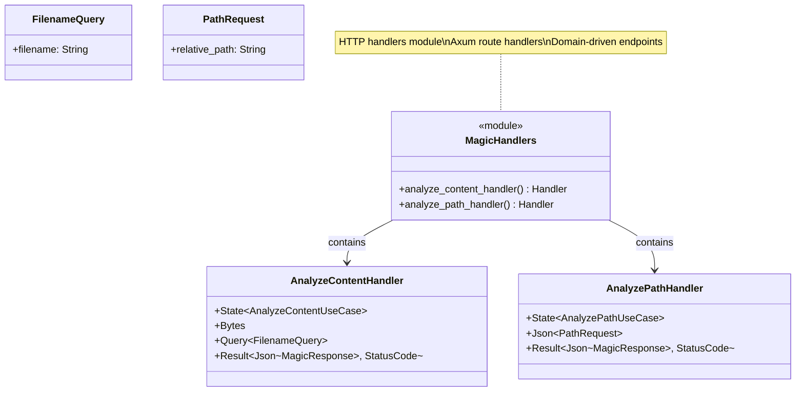

# Magic Handlers Class Diagram

## Overview

HTTP handlers for file magic analysis endpoints (`/v1/magic/content` and `/v1/magic/path`).

## Class Diagram

## Usage Scenario

### Content Analysis Endpoint

The content analysis handler manages binary data uploads. It uses extractors to retrieve the application state, query parameters for the filename, and the raw request body. Before processing, it validates that the filename conforms to Windows compatibility rules and that the body is not empty. If validation succeeds, it coordinates with the analysis use case and returns a detailed response.

### Path Analysis Endpoint

The path analysis handler allows clients to analyze files already present in the server's sandbox. It receives a JSON payload containing the relative path to the target file. The handler validates the path format, resolves it through the sandbox security layer, and returns the analysis results if the file is found and accessible.

## Error Handling and Mapping

The magic handlers provide consistent error responses by mapping application-level failures to appropriate HTTP status codes:
- **Input Validation**: Issues like invalid filenames or empty bodies result in a 400 Bad Request status.
- **Authentication**: Requests missing valid credentials are rejected with 401 Unauthorized.
- **Security Boundaries**: Attempts to access files outside the sandbox return 403 Forbidden.
- **Missing Resources**: Requesting a non-existent file returns 404 Not Found.
- **Processing Failures**: Internal analysis errors return 422 Unprocessable Entity or 500 Internal Server Error depending on the root cause.

## Testing Strategy

The handlers are verified through integration tests that simulate full HTTP request/response cycles:
- **Success Scenarios**: Verifies that valid content and path requests return 200 OK with correct analysis data.
- **Input Edge Cases**: Confirms that empty bodies or invalid paths are correctly rejected with 400 status codes.
- **Security Enforcement**: Ensures that path traversal attempts are blocked.
- **Error Consistency**: Validates that all error responses follow the standardized JSON error structure.

## Design Rationale

- **Axum Extractors**: Leverage Axum's type-safe extractors for request parsing
- **DTO Boundary**: Convert HTTP types to application DTOs immediately
- **Error Mapping**: Translate application errors to HTTP status codes
- **Validation**: Validate inputs at handler level before reaching use cases
- **Type Safety**: Strong typing prevents runtime errors
- **Testability**: Easy to test with Axum test utilities
- **Separation**: Handlers orchestrate HTTP concerns, use cases handle business logic
