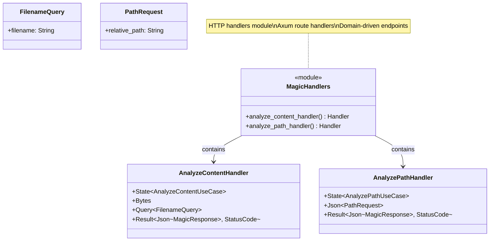
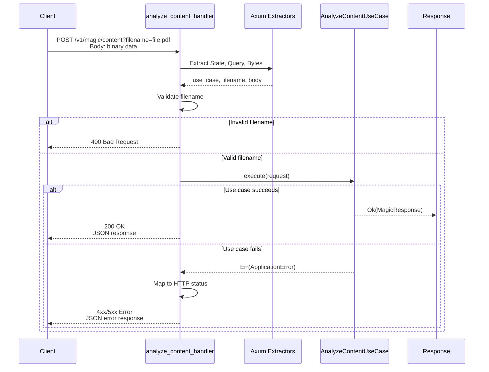
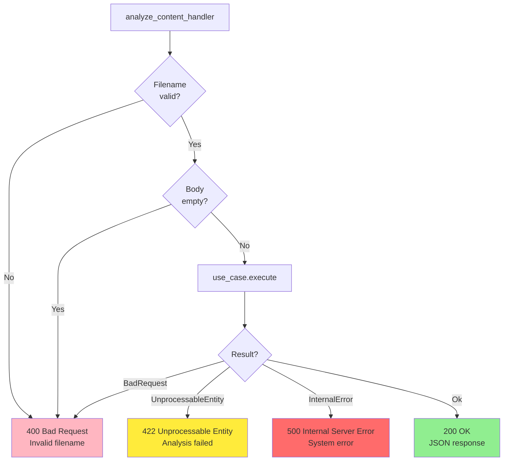
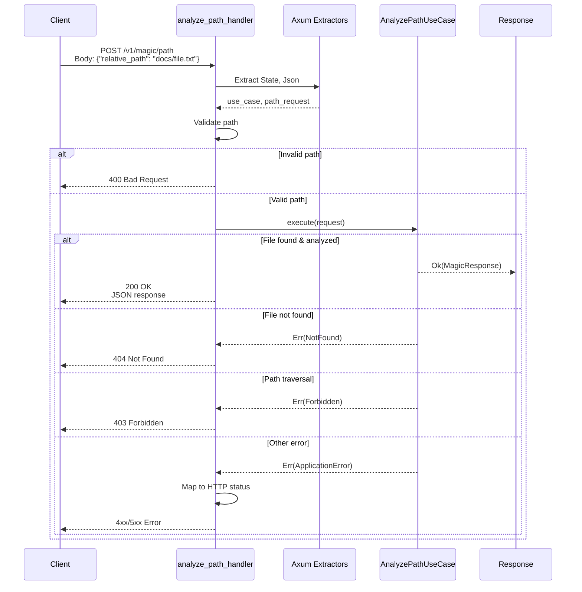

# Magic Handlers Class Diagram

## Overview

HTTP handlers for file magic analysis endpoints (`/v1/magic/content` and `/v1/magic/path`).

## Class Diagram



## analyze_content_handler

### Handler Signature

```rust
pub async fn analyze_content_handler(
    State(use_case): State<Arc<AnalyzeContentUseCase>>,
    Query(query): Query<FilenameQuery>,
    body: Bytes,
) -> Result<Json<MagicResponse>, (StatusCode, Json<ErrorResponse>)>
```

### Request Flow



### Request Example

```http
POST /v1/magic/content?filename=document.pdf HTTP/1.1
Host: api.example.com
Authorization: Basic YWRtaW46cGFzcw==
Content-Type: application/octet-stream
Content-Length: 12345

[binary PDF data...]
```

### Response Example

```http
HTTP/1.1 200 OK
Content-Type: application/json

{
  "request_id": "550e8400-e29b-41d4-a716-446655440000",
  "mime_type": "application/pdf",
  "description": "PDF document, version 1.4",
  "encoding": null,
  "analyzed_at": "2024-02-11T14:30:00Z"
}
```

### Error Handling



---

## analyze_path_handler

### Handler Signature

```rust
pub async fn analyze_path_handler(
    State(use_case): State<Arc<AnalyzePathUseCase>>,
    Json(request): Json<PathRequest>,
) -> Result<Json<MagicResponse>, (StatusCode, Json<ErrorResponse>)>
```

### Request Flow



### Request Example

```http
POST /v1/magic/path HTTP/1.1
Host: api.example.com
Authorization: Basic YWRtaW46cGFzcw==
Content-Type: application/json

{
  "relative_path": "documents/report.pdf"
}
```

### Response Example

```http
HTTP/1.1 200 OK
Content-Type: application/json

{
  "request_id": "550e8400-e29b-41d4-a716-446655440000",
  "mime_type": "application/pdf",
  "description": "PDF document, version 1.7",
  "encoding": null,
  "analyzed_at": "2024-02-11T14:30:00Z"
}
```

### Error Responses

| HTTP Status | Error Code | Condition | Example Message |
|-------------|------------|-----------|-----------------|
| 400 Bad Request | `validation_error` | Invalid path format | `"Validation failed: Absolute path not allowed"` |
| 403 Forbidden | `access_denied` | Path traversal attempt | `"Access denied: Path outside sandbox"` |
| 404 Not Found | `not_found` | File doesn't exist | `"File not found: documents/report.pdf"` |
| 422 Unprocessable Entity | `processing_error` | Analysis failed | `"Cannot process: Unsupported file format"` |
| 500 Internal Server Error | `internal_error` | System error | `"Internal server error"` |

---

## Handler Implementation

```rust
pub async fn analyze_content_handler(
    State(use_case): State<Arc<AnalyzeContentUseCase>>,
    Query(query): Query<FilenameQuery>,
    body: Bytes,
) -> Result<Json<MagicResponse>, (StatusCode, Json<ErrorResponse>)> {
    // Validate filename
    let filename = WindowsCompatibleFilename::new(query.filename)
        .map_err(|e| {
            let error_response = ErrorResponse::new(
                "validation_error",
                &format!("Invalid filename: {}", e),
            );
            (StatusCode::BAD_REQUEST, Json(error_response))
        })?;
    
    // Validate body
    if body.is_empty() {
        let error_response = ErrorResponse::new(
            "validation_error",
            "Request body is empty",
        );
        return Err((StatusCode::BAD_REQUEST, Json(error_response)));
    }
    
    // Create request DTO
    let request = AnalyzeContentRequest::new(body, filename);
    
    // Execute use case
    use_case
        .execute(request)
        .map(Json)
        .map_err(|e| {
            let (status, error_response) = map_application_error(e);
            (status, Json(error_response))
        })
}

pub async fn analyze_path_handler(
    State(use_case): State<Arc<AnalyzePathUseCase>>,
    Json(path_request): Json<PathRequest>,
) -> Result<Json<MagicResponse>, (StatusCode, Json<ErrorResponse>)> {
    // Validate and create RelativePath
    let relative_path = RelativePath::new(&path_request.relative_path)
        .map_err(|e| {
            let error_response = ErrorResponse::new(
                "validation_error",
                &format!("Invalid path: {}", e),
            );
            (StatusCode::BAD_REQUEST, Json(error_response))
        })?;
    
    // Create request DTO
    let request = AnalyzePathRequest::new(relative_path);
    
    // Execute use case
    use_case
        .execute(request)
        .map(Json)
        .map_err(|e| {
            let (status, error_response) = map_application_error(e);
            (status, Json(error_response))
        })
}
```

## Error Mapping

```rust
fn map_application_error(error: ApplicationError) -> (StatusCode, ErrorResponse) {
    match error {
        ApplicationError::BadRequest(msg) => (
            StatusCode::BAD_REQUEST,
            ErrorResponse::new("validation_error", &msg),
        ),
        ApplicationError::Unauthorized(msg) => (
            StatusCode::UNAUTHORIZED,
            ErrorResponse::new("authentication_required", &msg),
        ),
        ApplicationError::Forbidden(msg) => (
            StatusCode::FORBIDDEN,
            ErrorResponse::new("access_denied", &msg),
        ),
        ApplicationError::NotFound(msg) => (
            StatusCode::NOT_FOUND,
            ErrorResponse::new("not_found", &msg),
        ),
        ApplicationError::UnprocessableEntity(msg) => (
            StatusCode::UNPROCESSABLE_ENTITY,
            ErrorResponse::new("processing_error", &msg),
        ),
        ApplicationError::InternalError(msg) => (
            StatusCode::INTERNAL_SERVER_ERROR,
            ErrorResponse::new("internal_error", "Internal server error"),
        ),
        ApplicationError::Timeout => (
            StatusCode::GATEWAY_TIMEOUT,
            ErrorResponse::new("timeout", "Request timeout"),
        ),
    }
}
```

## Testing

```rust
#[tokio::test]
async fn test_analyze_content_success() {
    let app = create_test_app();
    
    let response = app
        .post("/v1/magic/content?filename=test.pdf")
        .body(b"PDF data")
        .send()
        .await;
    
    assert_eq!(response.status(), StatusCode::OK);
    let json: MagicResponse = response.json().await;
    assert_eq!(json.mime_type.as_str(), "application/pdf");
}

#[tokio::test]
async fn test_analyze_content_empty_body() {
    let app = create_test_app();
    
    let response = app
        .post("/v1/magic/content?filename=test.pdf")
        .body(b"")
        .send()
        .await;
    
    assert_eq!(response.status(), StatusCode::BAD_REQUEST);
}

#[tokio::test]
async fn test_analyze_path_success() {
    let app = create_test_app();
    
    let request = json!({
        "relative_path": "documents/report.pdf"
    });
    
    let response = app
        .post("/v1/magic/path")
        .json(&request)
        .send()
        .await;
    
    assert_eq!(response.status(), StatusCode::OK);
}

#[tokio::test]
async fn test_analyze_path_not_found() {
    let app = create_test_app();
    
    let request = json!({
        "relative_path": "nonexistent/file.pdf"
    });
    
    let response = app
        .post("/v1/magic/path")
        .json(&request)
        .send()
        .await;
    
    assert_eq!(response.status(), StatusCode::NOT_FOUND);
}

#[tokio::test]
async fn test_analyze_path_traversal() {
    let app = create_test_app();
    
    let request = json!({
        "relative_path": "../../../etc/passwd"
    });
    
    let response = app
        .post("/v1/magic/path")
        .json(&request)
        .send()
        .await;
    
    assert_eq!(response.status(), StatusCode::BAD_REQUEST);
}
```

## Design Rationale

- **Axum Extractors**: Leverage Axum's type-safe extractors for request parsing
- **DTO Boundary**: Convert HTTP types to application DTOs immediately
- **Error Mapping**: Translate application errors to HTTP status codes
- **Validation**: Validate inputs at handler level before reaching use cases
- **Type Safety**: Strong typing prevents runtime errors
- **Testability**: Easy to test with Axum test utilities
- **Separation**: Handlers orchestrate HTTP concerns, use cases handle business logic
