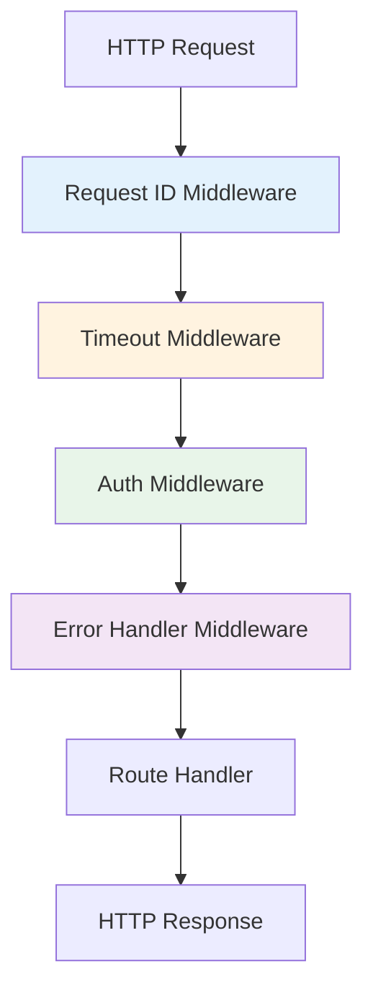
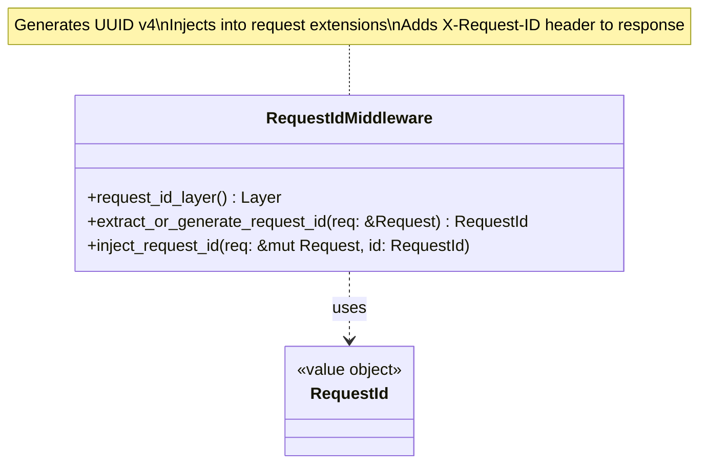
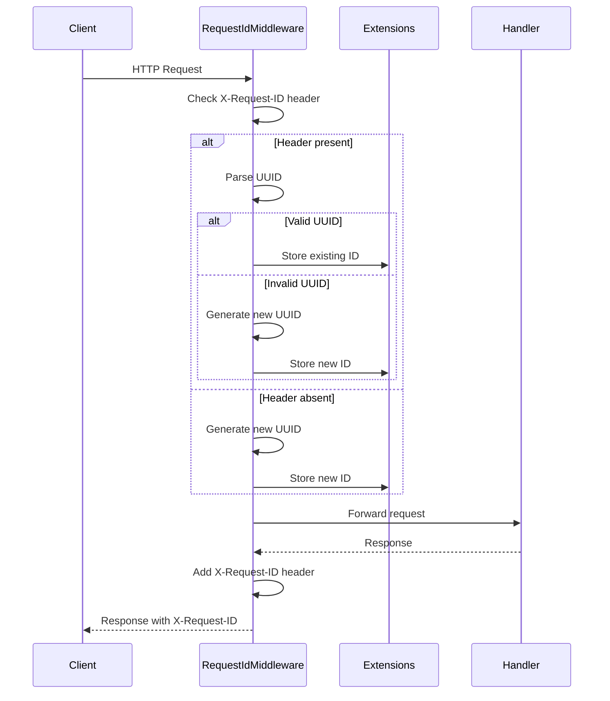

# Middleware Class Diagrams

## Overview

Axum middleware layers for cross-cutting concerns: request ID injection, authentication, timeout enforcement, and error handling.

## Middleware Architecture

---

## Request ID Middleware

### Class Diagram

### Flow

## Request ID Middleware

The Request ID middleware ensures that every request has a unique identifier for tracing and correlation. It follows a multi-step logic:
1. **Extraction**: Checks if the incoming request already has an `X-Request-ID` header.
2. **Generation**: If no valid ID is found, it generates a new random UUID v4.
3. **Injection**: Stores the identifier in the request extensions so it can be accessed by use cases and handlers.
4. **Response**: Adds the `X-Request-ID` header to the outgoing response, allowing clients to correlate logs.

## Authentication Middleware

The authentication middleware enforces security policies for protected endpoints using HTTP Basic Authentication. It performs several key functions:
1. **Bypass Check**: Identifies public endpoints like the health check and allows them to proceed without verification.
2. **Header Extraction**: Retrieves and decodes the `Authorization` header.
3. **Format Validation**: Ensures the header is correctly formatted as "Basic " followed by Base64-encoded credentials.
4. **Credential Verification**: Delegates the actual verification to the authentication service, which uses constant-time comparison to prevent timing attacks.
5. **Authorization Enforcement**: Blocks access with a 401 status code if credentials are missing or invalid.

## Timeout Middleware

The timeout middleware prevents requests from hanging indefinitely and consuming system resources. It enforces a maximum duration for the entire request/response lifecycle. If the handler does not complete within the specified time (e.g., 30 seconds), the middleware cancels the operation and returns a 504 Gateway Timeout status to the client.

## Error Handler Middleware

The global error handler provides a standardized way to respond to failures across the entire middleware stack and handler execution. It intercepts errors and maps them to appropriate HTTP status codes:
- **Timeouts**: Maps to 504 Gateway Timeout.
- **Authentication**: Maps to 401 Unauthorized.
- **Application Errors**: Maps to their semantic HTTP equivalents (400, 403, 404, 422).
- **System Errors**: Maps any unhandled or unexpected failures to 500 Internal Server Error.

The error handler also ensures that all error responses follow the standard JSON structure and include the request ID for troubleshooting.

## Middleware Composition

Middleware layers are composed using a standard builder pattern during router initialization. They are applied in a specific order to ensure correct execution flow:
1. **Request ID** (Outer): Always executed first to provide correlation IDs for subsequent layers.
2. **Timeout**: Enforces limits on all downstream processing.
3. **Authentication**: Secures endpoints before business logic execution.
4. **Error Handler** (Inner): Catches and formats failures from the handlers.

## Design Rationale

- **Request ID**: Enables distributed tracing and log correlation
- **Timeout**: Prevents hung requests and resource exhaustion
- **Authentication**: Secures endpoints with Basic Auth
- **Error Handler**: Provides consistent error responses
- **Composability**: Tower middleware layers compose cleanly
- **Type Safety**: Axum extractors provide compile-time guarantees
- **Testability**: Each middleware is independently testable
