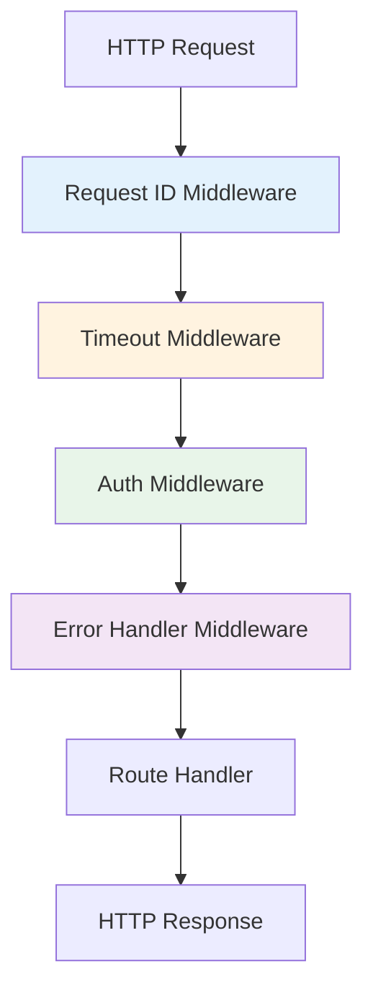
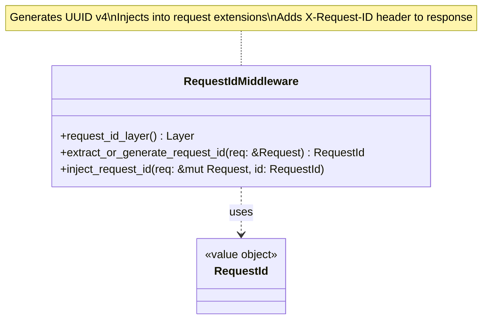
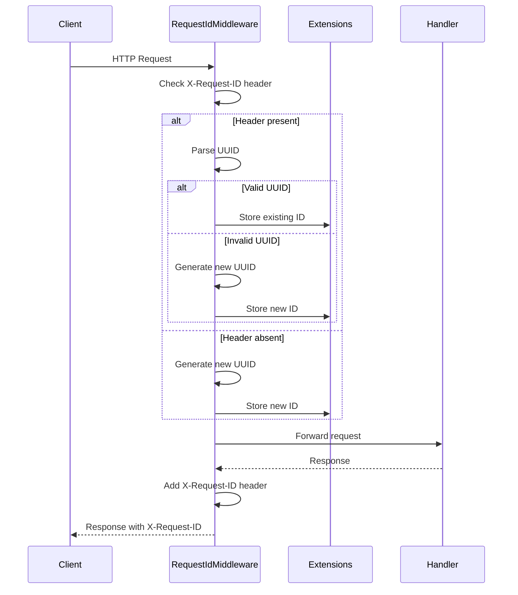
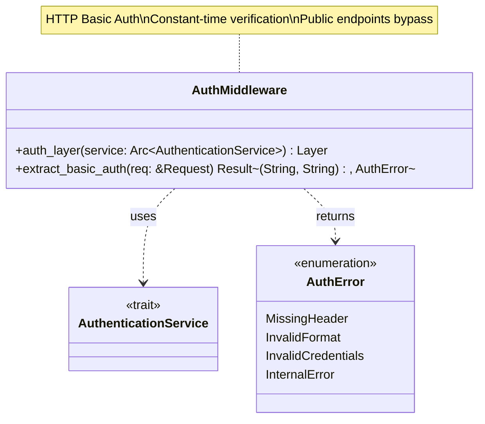
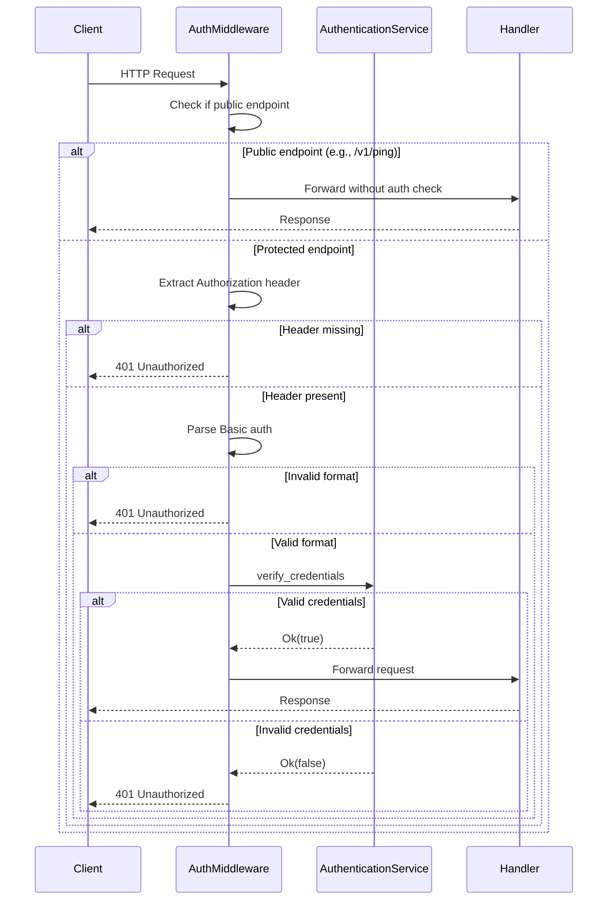
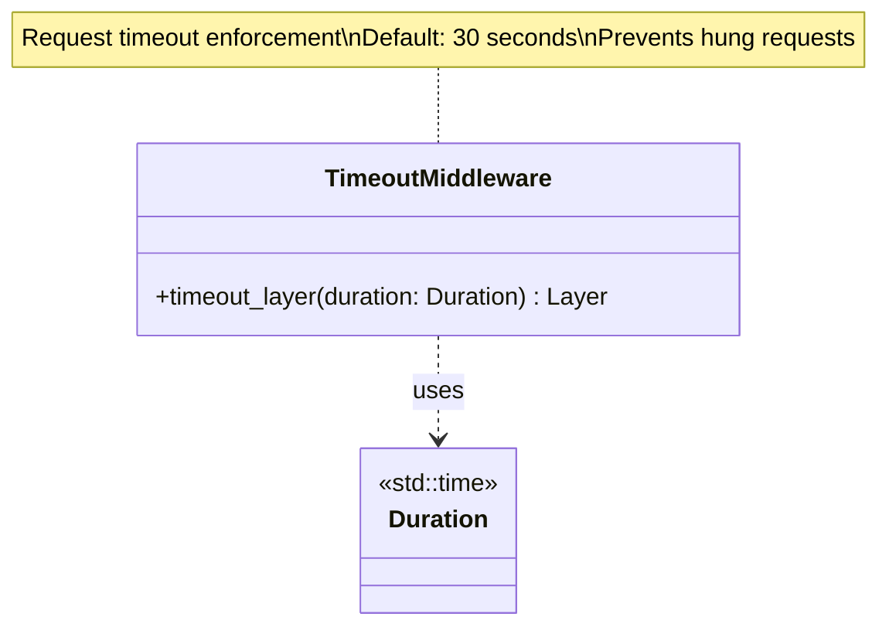
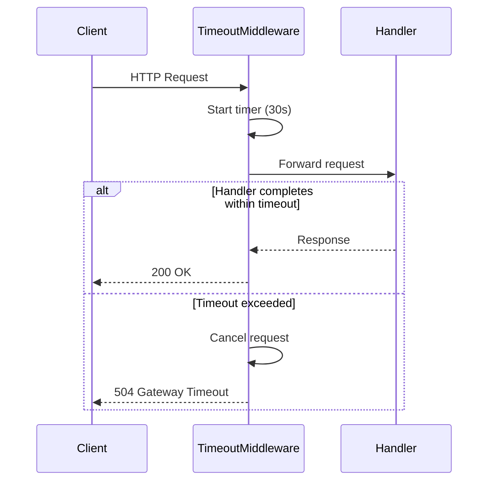
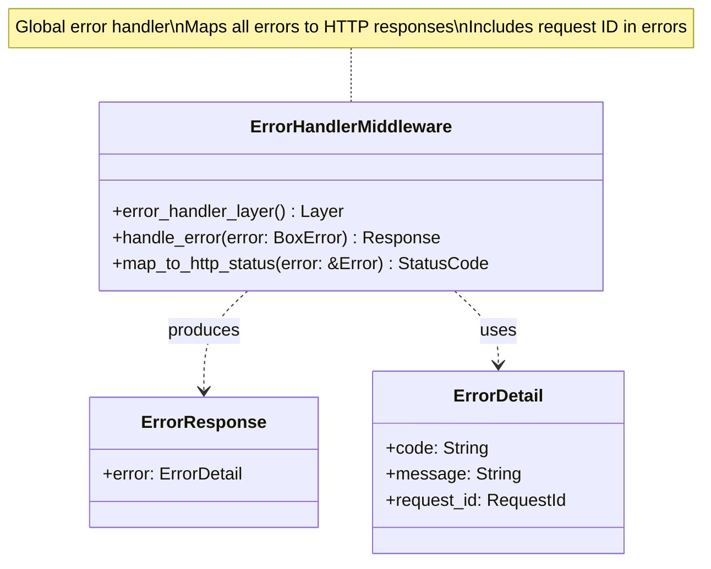
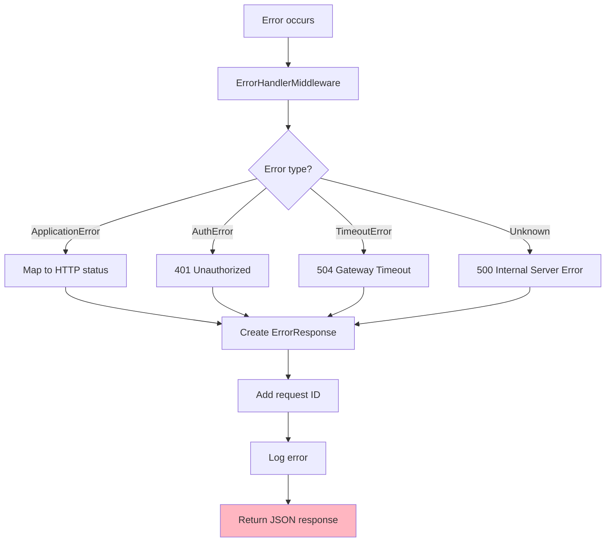

# Middleware Class Diagrams

## Overview

Axum middleware layers for cross-cutting concerns: request ID injection, authentication, timeout enforcement, and error handling.

## Middleware Architecture



---

## Request ID Middleware

### Class Diagram



### Flow



### Implementation

```rust
pub fn request_id_layer() -> ServiceBuilder<Stack<RequestIdLayer, Identity>> {
    ServiceBuilder::new()
        .layer(RequestIdLayer)
}

pub struct RequestIdLayer;

impl<S> Layer<S> for RequestIdLayer {
    type Service = RequestIdMiddleware<S>;
    
    fn layer(&self, inner: S) -> Self::Service {
        RequestIdMiddleware { inner }
    }
}

pub struct RequestIdMiddleware<S> {
    inner: S,
}

impl<S, B> Service<Request<B>> for RequestIdMiddleware<S>
where
    S: Service<Request<B>, Response = Response> + Clone + Send + 'static,
    B: Send + 'static,
{
    type Response = S::Response;
    type Error = S::Error;
    type Future = /* ... */;
    
    fn call(&mut self, mut req: Request<B>) -> Self::Future {
        // Extract or generate request ID
        let request_id = req
            .headers()
            .get("x-request-id")
            .and_then(|h| h.to_str().ok())
            .and_then(|s| RequestId::parse(s).ok())
            .unwrap_or_else(RequestId::new);
        
        // Inject into request extensions
        req.extensions_mut().insert(request_id.clone());
        
        // Continue to next layer
        let fut = self.inner.call(req);
        
        async move {
            let mut res = fut.await?;
            
            // Add X-Request-ID header to response
            res.headers_mut().insert(
                "x-request-id",
                request_id.to_string().parse().unwrap(),
            );
            
            Ok(res)
        }
    }
}
```

---

## Authentication Middleware

### Class Diagram



### Flow



### Public Endpoints

| Path | Method | Auth Required |
|------|--------|---------------|
| `/v1/ping` | GET | ❌ No |
| `/v1/magic/content` | POST | ✅ Yes |
| `/v1/magic/path` | POST | ✅ Yes |

### Implementation

```rust
pub fn auth_layer(
    auth_service: Arc<dyn AuthenticationService>,
) -> ServiceBuilder<Stack<AuthLayer, Identity>> {
    ServiceBuilder::new()
        .layer(AuthLayer { auth_service })
}

pub struct AuthLayer {
    auth_service: Arc<dyn AuthenticationService>,
}

impl<S> Layer<S> for AuthLayer {
    type Service = AuthMiddleware<S>;
    
    fn layer(&self, inner: S) -> Self::Service {
        AuthMiddleware {
            inner,
            auth_service: self.auth_service.clone(),
        }
    }
}

pub struct AuthMiddleware<S> {
    inner: S,
    auth_service: Arc<dyn AuthenticationService>,
}

impl<S, B> Service<Request<B>> for AuthMiddleware<S>
where
    S: Service<Request<B>, Response = Response> + Clone + Send + 'static,
    B: Send + 'static,
{
    type Response = S::Response;
    type Error = S::Error;
    type Future = /* ... */;
    
    fn call(&mut self, req: Request<B>) -> Self::Future {
        // Check if endpoint is public
        if is_public_endpoint(req.uri().path()) {
            return self.inner.call(req);
        }
        
        // Extract Authorization header
        let auth_header = match req.headers().get("authorization") {
            Some(h) => h,
            None => return ready(Err(AuthError::MissingHeader)),
        };
        
        // Parse Basic auth
        let (username, password) = match extract_basic_auth(auth_header) {
            Ok(creds) => creds,
            Err(e) => return ready(Err(e)),
        };
        
        // Verify credentials
        let auth_service = self.auth_service.clone();
        let fut = self.inner.call(req);
        
        async move {
            let is_valid = auth_service
                .verify_credentials(&username, &password)
                .map_err(|_| AuthError::InternalError)?;
            
            if is_valid {
                Ok(fut.await?)
            } else {
                Err(AuthError::InvalidCredentials)
            }
        }
    }
}

fn extract_basic_auth(header: &HeaderValue) -> Result<(String, String), AuthError> {
    let auth_str = header.to_str().map_err(|_| AuthError::InvalidFormat)?;
    
    if !auth_str.starts_with("Basic ") {
        return Err(AuthError::InvalidFormat);
    }
    
    let encoded = &auth_str[6..];
    let decoded = base64::decode(encoded).map_err(|_| AuthError::InvalidFormat)?;
    let credentials = String::from_utf8(decoded).map_err(|_| AuthError::InvalidFormat)?;
    
    let parts: Vec<&str> = credentials.splitn(2, ':').collect();
    if parts.len() != 2 {
        return Err(AuthError::InvalidFormat);
    }
    
    Ok((parts[0].to_string(), parts[1].to_string()))
}
```

---

## Timeout Middleware

### Class Diagram



### Flow



### Implementation

```rust
use tower::timeout::Timeout;
use std::time::Duration;

pub fn timeout_layer(duration: Duration) -> Timeout {
    Timeout::new(duration)
}

// Usage in router
let app = Router::new()
    .route("/v1/magic/content", post(analyze_content_handler))
    .layer(timeout_layer(Duration::from_secs(30)));
```

### Configuration

| Endpoint | Timeout | Rationale |
|----------|---------|-----------|
| `/v1/ping` | 2s | Health check should be fast |
| `/v1/magic/content` | 30s | File analysis can be slow for large files |
| `/v1/magic/path` | 30s | File I/O + analysis |

---

## Error Handler Middleware

### Class Diagram



### Flow



### Implementation

```rust
pub fn error_handler_layer() -> HandleErrorLayer</* ... */> {
    HandleErrorLayer::new(handle_error)
}

async fn handle_error(error: BoxError) -> (StatusCode, Json<ErrorResponse>) {
    if error.is::<tower::timeout::error::Elapsed>() {
        return (
            StatusCode::GATEWAY_TIMEOUT,
            Json(ErrorResponse::new("timeout", "Request timeout")),
        );
    }
    
    if let Some(auth_error) = error.downcast_ref::<AuthError>() {
        return (
            StatusCode::UNAUTHORIZED,
            Json(ErrorResponse::new(
                "authentication_required",
                "Authentication failed",
            )),
        );
    }
    
    // Default: Internal server error
    (
        StatusCode::INTERNAL_SERVER_ERROR,
        Json(ErrorResponse::new(
            "internal_error",
            "Internal server error",
        )),
    )
}
```

## Middleware Composition

```rust
pub fn create_app(/* dependencies */) -> Router {
    Router::new()
        // Routes
        .route("/v1/ping", get(ping_handler))
        .route("/v1/magic/content", post(analyze_content_handler))
        .route("/v1/magic/path", post(analyze_path_handler))
        // Middleware (applied in reverse order)
        .layer(error_handler_layer())          // 4. Handle errors
        .layer(auth_layer(auth_service))       // 3. Authenticate
        .layer(timeout_layer(Duration::from_secs(30)))  // 2. Timeout
        .layer(request_id_layer())             // 1. Request ID (first)
}
```

## Design Rationale

- **Request ID**: Enables distributed tracing and log correlation
- **Timeout**: Prevents hung requests and resource exhaustion
- **Authentication**: Secures endpoints with Basic Auth
- **Error Handler**: Provides consistent error responses
- **Composability**: Tower middleware layers compose cleanly
- **Type Safety**: Axum extractors provide compile-time guarantees
- **Testability**: Each middleware is independently testable
