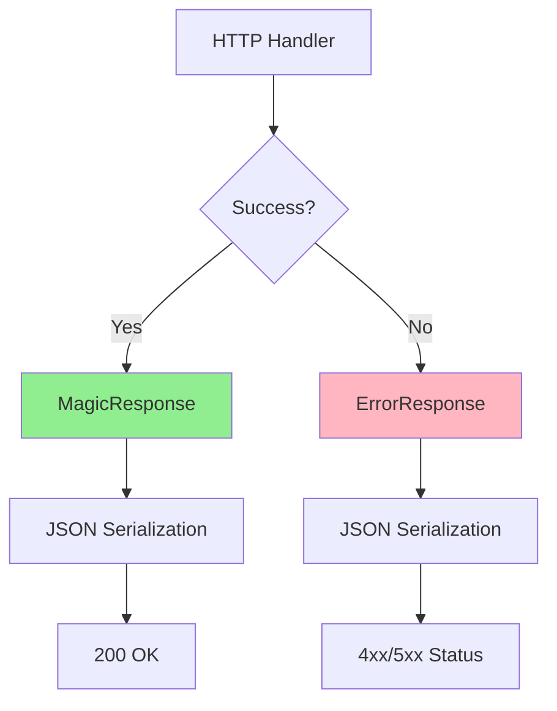
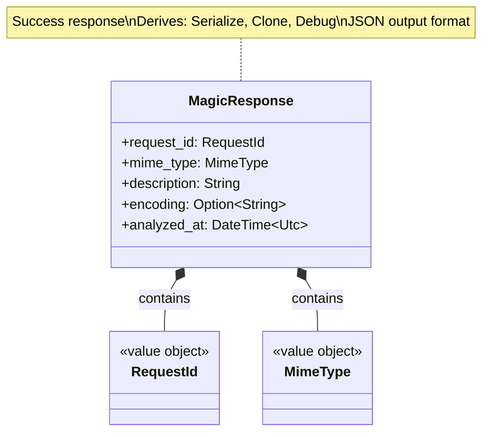

# Response Types Class Diagrams

## Overview

Response types define the structure of HTTP responses (both success and error), with JSON serialization support.

## Response Architecture

---

## MagicResponse

### Class Diagram

## Success Response: MagicResponse

The success response provides the results of a file magic analysis. It is serialized to JSON and returned with a 200 OK status.

### Success Fields

| Field | Type | Required | Description |
|-------|------|----------|-------------|
| `request_id` | UUID String | Yes | Unique tracking identifier for the request |
| `mime_type` | String | Yes | The detected MIME type (e.g., "application/pdf") |
| `description` | String | Yes | Human-readable file type description |
| `encoding` | String | No | Character encoding if applicable (e.g., "utf-8") |
| `analyzed_at` | DateTime | Yes | Precise UTC timestamp of the analysis |

## Error Response: ErrorResponse

When an operation fails, the server returns a standardized error response. This ensures that clients can handle failures consistently across all endpoints.

### Error Fields

| Field | Type | Required | Description |
|-------|------|----------|-------------|
| `error.code` | String | Yes | Machine-readable machine code (e.g., "validation_error") |
| `error.message` | String | Yes | Descriptive message explaining the failure |
| `error.request_id` | UUID String | No | Request identifier for log correlation |

### Standard Error Codes

| Code | HTTP Status | Use Case |
|------|-------------|----------|
| `validation_error` | 400 | Invalid input parameters or body |
| `authentication_required`| 401 | Missing or invalid Basic Auth credentials |
| `access_denied` | 403 | Path traversal or sandbox violation |
| `not_found` | 404 | Specified file does not exist |
| `processing_error` | 422 | Semantic failure during analysis |
| `internal_error` | 500 | Unexpected system failure |
| `timeout` | 504 | Analysis exceeded the allowed time limit |

## Response Serialization and Mapping

The system uses an automated serialization process to transform internal data structures into HTTP responses:
1. **Success Mapping**: Domain entities are converted into response DTOs, where optional fields like encoding are omitted if they are not present.
2. **Error Mapping**: Application-level errors are matched to specific status codes and machine-readable error codes.
3. **Format Enforcement**: All responses are delivered as JSON with UTF-8 encoding.
4. **Consistency**: The inclusion of a request ID in every response enables end-to-end tracing from the client to the backend logs.

## Design Rationale

- **Consistent Format**: All responses follow same JSON structure
- **Request ID**: Included in both success and error for tracing
- **Machine-Readable**: Error codes enable client-side handling
- **Human-Readable**: Error messages provide context
- **Type Safety**: Serde ensures correct serialization
- **Optional Fields**: `Option` fields omitted from JSON if `None`
- **Standard HTTP**: Follows REST API best practices
- **Testability**: Easy to serialize/deserialize for testing
