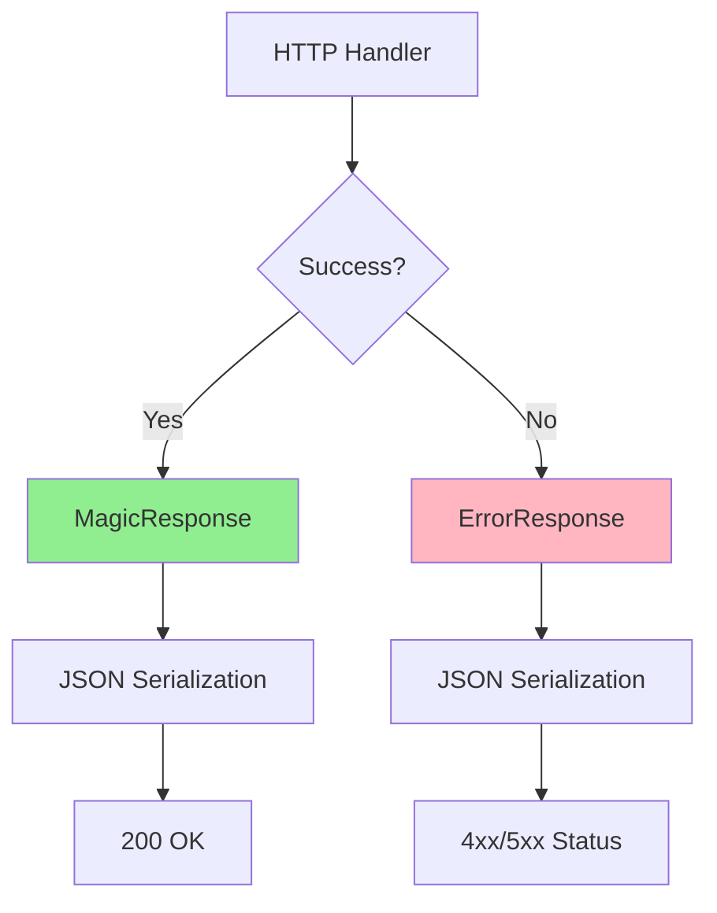
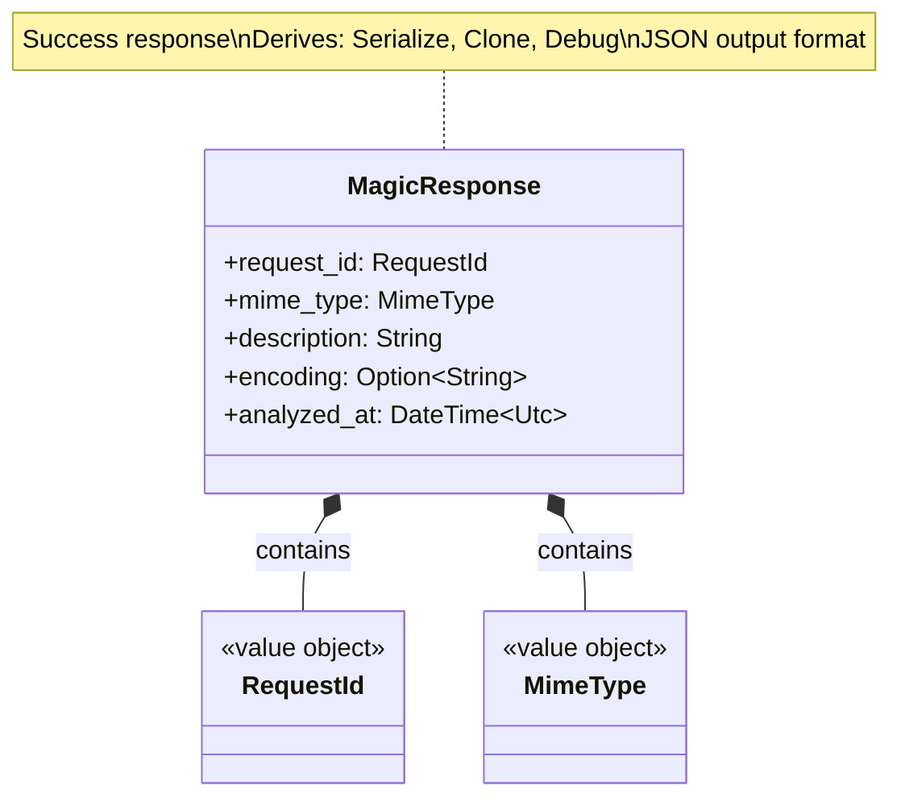
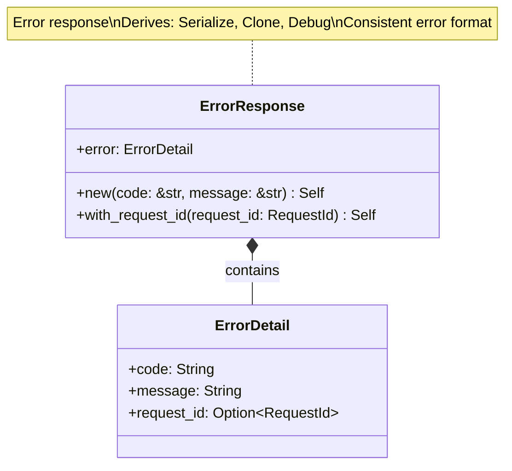

# Response Types Class Diagrams

## Overview

Response types define the structure of HTTP responses (both success and error), with JSON serialization support.

## Response Architecture



---

## MagicResponse

### Class Diagram



### JSON Structure

```json
{
  "request_id": "550e8400-e29b-41d4-a716-446655440000",
  "mime_type": "application/pdf",
  "description": "PDF document, version 1.7",
  "encoding": null,
  "analyzed_at": "2024-02-11T14:30:00Z"
}
```

### Fields

| Field | Type | Required | Description | Example |
|-------|------|----------|-------------|---------|
| `request_id` | `String` (UUID) | Yes | Unique request identifier | `"550e8400-..."` |
| `mime_type` | `String` | Yes | MIME type of analyzed file | `"text/plain"` |
| `description` | `String` | Yes | Human-readable description | `"ASCII text"` |
| `encoding` | `String?` | No | Character encoding (if applicable) | `"utf-8"` |
| `analyzed_at` | `String` (ISO 8601) | Yes | Analysis timestamp (UTC) | `"2024-02-11T14:30:00Z"` |

### Serialization

```rust
use serde::Serialize;
use chrono::{DateTime, Utc};

#[derive(Debug, Clone, Serialize)]
pub struct MagicResponse {
    pub request_id: RequestId,
    pub mime_type: MimeType,
    pub description: String,
    
    #[serde(skip_serializing_if = "Option::is_none")]
    pub encoding: Option<String>,
    
    #[serde(with = "chrono::serde::ts_seconds")]
    pub analyzed_at: DateTime<Utc>,
}

impl From<MagicResult> for MagicResponse {
    fn from(result: MagicResult) -> Self {
        Self {
            request_id: RequestId::new(),
            mime_type: result.mime_type().clone(),
            description: result.description().to_string(),
            encoding: result.encoding().map(|s| s.to_string()),
            analyzed_at: result.analyzed_at(),
        }
    }
}
```

### Usage in Handlers

```rust
pub async fn analyze_content_handler(
    State(use_case): State<Arc<AnalyzeContentUseCase>>,
    Query(query): Query<FilenameQuery>,
    body: Bytes,
) -> Result<Json<MagicResponse>, (StatusCode, Json<ErrorResponse>)> {
    let request = AnalyzeContentRequest::new(body, query.filename)?;
    
    let response = use_case.execute(request)?;
    
    Ok(Json(response))  // Axum serializes to JSON
}
```

---

## ErrorResponse

### Class Diagram



### JSON Structure

```json
{
  "error": {
    "code": "validation_error",
    "message": "Invalid filename: Filename too long (311, max 310)",
    "request_id": "550e8400-e29b-41d4-a716-446655440000"
  }
}
```

### Fields

| Field | Type | Required | Description | Example |
|-------|------|----------|-------------|---------|
| `error.code` | `String` | Yes | Machine-readable error code | `"validation_error"` |
| `error.message` | `String` | Yes | Human-readable error message | `"Invalid filename"` |
| `error.request_id` | `String?` | No | Request ID for tracing | `"550e8400-..."` |

### Error Codes

| Code | HTTP Status | Description |
|------|-------------|-------------|
| `validation_error` | 400 | Input validation failed |
| `authentication_required` | 401 | Authentication missing or invalid |
| `access_denied` | 403 | Authenticated but not authorized |
| `not_found` | 404 | Resource not found |
| `processing_error` | 422 | Valid input but processing failed |
| `internal_error` | 500 | Unexpected system error |
| `timeout` | 504 | Request timeout |

### Serialization

```rust
use serde::Serialize;

#[derive(Debug, Clone, Serialize)]
pub struct ErrorResponse {
    pub error: ErrorDetail,
}

#[derive(Debug, Clone, Serialize)]
pub struct ErrorDetail {
    pub code: String,
    pub message: String,
    
    #[serde(skip_serializing_if = "Option::is_none")]
    pub request_id: Option<RequestId>,
}

impl ErrorResponse {
    pub fn new(code: &str, message: &str) -> Self {
        Self {
            error: ErrorDetail {
                code: code.to_string(),
                message: message.to_string(),
                request_id: None,
            },
        }
    }
    
    pub fn with_request_id(mut self, request_id: RequestId) -> Self {
        self.error.request_id = Some(request_id);
        self
    }
}
```

### Usage in Handlers

```rust
pub async fn analyze_content_handler(
    State(use_case): State<Arc<AnalyzeContentUseCase>>,
    Query(query): Query<FilenameQuery>,
    body: Bytes,
) -> Result<Json<MagicResponse>, (StatusCode, Json<ErrorResponse>)> {
    // Validate input
    if body.is_empty() {
        let error = ErrorResponse::new(
            "validation_error",
            "Request body is empty"
        );
        return Err((StatusCode::BAD_REQUEST, Json(error)));
    }
    
    // Execute use case
    use_case
        .execute(request)
        .map(Json)
        .map_err(|e| {
            let (status, error) = map_application_error(e);
            (status, Json(error))
        })
}

fn map_application_error(error: ApplicationError) -> (StatusCode, ErrorResponse) {
    match error {
        ApplicationError::BadRequest(msg) => (
            StatusCode::BAD_REQUEST,
            ErrorResponse::new("validation_error", &msg),
        ),
        ApplicationError::NotFound(msg) => (
            StatusCode::NOT_FOUND,
            ErrorResponse::new("not_found", &msg),
        ),
        ApplicationError::Forbidden(msg) => (
            StatusCode::FORBIDDEN,
            ErrorResponse::new("access_denied", &msg),
        ),
        ApplicationError::UnprocessableEntity(msg) => (
            StatusCode::UNPROCESSABLE_ENTITY,
            ErrorResponse::new("processing_error", &msg),
        ),
        ApplicationError::InternalError(_) => (
            StatusCode::INTERNAL_SERVER_ERROR,
            ErrorResponse::new("internal_error", "Internal server error"),
        ),
        ApplicationError::Timeout => (
            StatusCode::GATEWAY_TIMEOUT,
            ErrorResponse::new("timeout", "Request timeout"),
        ),
        _ => (
            StatusCode::INTERNAL_SERVER_ERROR,
            ErrorResponse::new("internal_error", "Unknown error"),
        ),
    }
}
```

---

## Response Examples

### Success Response

```http
HTTP/1.1 200 OK
Content-Type: application/json
X-Request-ID: 550e8400-e29b-41d4-a716-446655440000

{
  "request_id": "550e8400-e29b-41d4-a716-446655440000",
  "mime_type": "text/plain",
  "description": "ASCII text",
  "encoding": "us-ascii",
  "analyzed_at": "2024-02-11T14:30:00Z"
}
```

### Error Response (Validation)

```http
HTTP/1.1 400 Bad Request
Content-Type: application/json
X-Request-ID: 550e8400-e29b-41d4-a716-446655440000

{
  "error": {
    "code": "validation_error",
    "message": "Invalid filename: Filename too long (311, max 310)",
    "request_id": "550e8400-e29b-41d4-a716-446655440000"
  }
}
```

### Error Response (Not Found)

```http
HTTP/1.1 404 Not Found
Content-Type: application/json
X-Request-ID: 550e8400-e29b-41d4-a716-446655440000

{
  "error": {
    "code": "not_found",
    "message": "File not found: documents/report.pdf",
    "request_id": "550e8400-e29b-41d4-a716-446655440000"
  }
}
```

### Error Response (Authentication)

```http
HTTP/1.1 401 Unauthorized
Content-Type: application/json
WWW-Authenticate: Basic realm="magicer"

{
  "error": {
    "code": "authentication_required",
    "message": "Authentication required"
  }
}
```

## Testing

```rust
#[tokio::test]
async fn test_success_response_serialization() {
    let response = MagicResponse {
        request_id: RequestId::new(),
        mime_type: MimeType::new("text/plain").unwrap(),
        description: "ASCII text".to_string(),
        encoding: Some("utf-8".to_string()),
        analyzed_at: Utc::now(),
    };
    
    let json = serde_json::to_string(&response).unwrap();
    
    assert!(json.contains("\"mime_type\":\"text/plain\""));
    assert!(json.contains("\"description\":\"ASCII text\""));
    assert!(json.contains("\"encoding\":\"utf-8\""));
}

#[tokio::test]
async fn test_error_response_serialization() {
    let error = ErrorResponse::new(
        "validation_error",
        "Invalid input"
    );
    
    let json = serde_json::to_string(&error).unwrap();
    
    assert!(json.contains("\"code\":\"validation_error\""));
    assert!(json.contains("\"message\":\"Invalid input\""));
}
```

## Design Rationale

- **Consistent Format**: All responses follow same JSON structure
- **Request ID**: Included in both success and error for tracing
- **Machine-Readable**: Error codes enable client-side handling
- **Human-Readable**: Error messages provide context
- **Type Safety**: Serde ensures correct serialization
- **Optional Fields**: `Option` fields omitted from JSON if `None`
- **Standard HTTP**: Follows REST API best practices
- **Testability**: Easy to serialize/deserialize for testing
