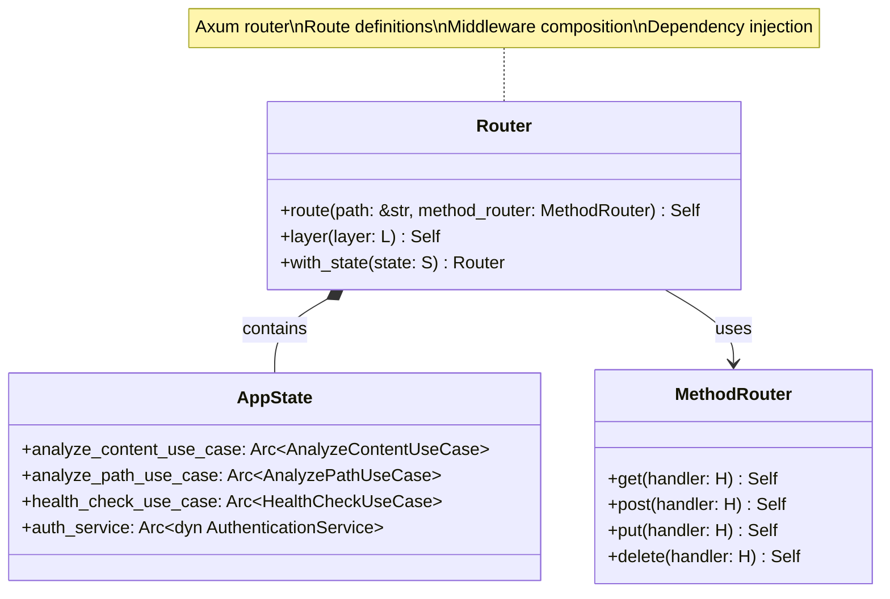
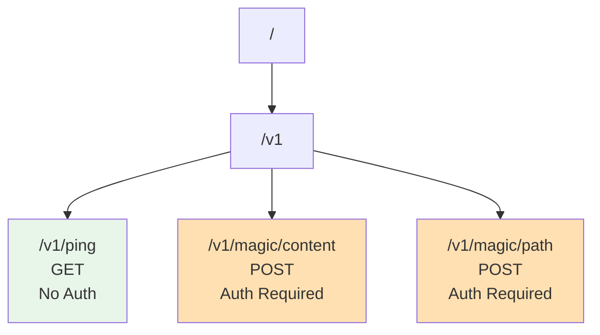
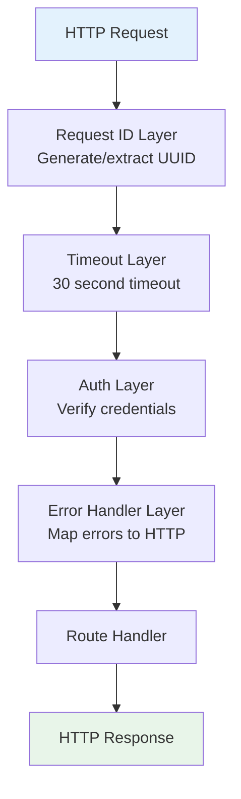

# Router Class Diagram <!-- omit in toc -->

- [Overview](#overview)
- [Class Diagram](#class-diagram)
- [Route Configuration](#route-configuration)
- [Route Table](#route-table)
- [Middleware Stack](#middleware-stack)
- [Router Construction and Logic](#router-construction-and-logic)
- [State Management and Injection](#state-management-and-injection)
- [Router Implementation Pattern](#router-implementation-pattern)
- [Server Initialization and Lifecycle](#server-initialization-and-lifecycle)
- [API Integration Specification](#api-integration-specification)
- [Design Rationale](#design-rationale)

---

## Overview

The Axum router configuration defines all HTTP routes, applies middleware layers, and wires dependencies.

## Class Diagram

## Route Configuration

## Route Table

| Path | Method | Auth | Handler | Description |
|------|--------|------|---------|-------------|
| `/v1/ping` | GET | ❌ No | `ping_handler` | Health check / liveness probe |
| `/v1/magic/content` | POST | ✅ Yes | `analyze_content_handler` | Analyze uploaded binary content |
| `/v1/magic/path` | POST | ✅ Yes | `analyze_path_handler` | Analyze file by relative path |

## Middleware Stack

## Router Construction and Logic

The router is constructed using a declarative approach, defining the relationship between HTTP paths, methods, and their corresponding handlers. The construction process involves:
1. **Endpoint Definition**: Mapping GET and POST methods to specific handler functions.
2. **Middleware Application**: Layering cross-cutting concerns in a specific execution order.
3. **State Injection**: Providing the application state to all handlers through dependency injection.

## State Management and Injection

The application state is encapsulated in a central structure and wrapped in an atomic reference counter. This ensures that all handlers have thread-safe access to necessary dependencies like use cases, services, and configuration. The state is injected once during router initialization and is automatically extracted by Axum for each incoming request.

## Router Implementation Pattern

The implementation follows a modular pattern:
- **Health Routes**: Defined as public endpoints without authentication middleware.
- **Magic Analysis Routes**: Grouped together with mandatory authentication and specific timeouts.
- **Global Layers**: Universal middleware applied to all routes, such as request ID generation and global error handling.

## Server Initialization and Lifecycle

The server lifecycle starts in the main entry point, which coordinates several steps:
1. **Config Loading**: Reads and validates settings from files and environment variables.
2. **Infrastructure Setup**: Initializes the libmagic repository, authentication service, and sandbox.
3. **Use Case Creation**: Instantiates the business logic components with their infrastructure dependencies.
4. **Router Configuration**: Builds the router with all routes, middleware, and state.
5. **Startup**: Binds the TCP listener and begins serving requests asynchronously.

## API Integration Specification

The API follows a standardized RESTful structure:
- **Ping**: A public GET endpoint at `/v1/ping` for health monitoring.
- **Content Analysis**: A protected POST endpoint at `/v1/magic/content` that accepts binary data and a filename query parameter.
- **Path Analysis**: A protected POST endpoint at `/v1/magic/path` that accepts a JSON payload with a relative file path.

All protected endpoints require HTTP Basic Authentication and return results in a consistent JSON format.

## Design Rationale

- **Clean Separation**: Routes, middleware, and handlers are clearly separated
- **Dependency Injection**: All dependencies passed via `AppState`
- **Type Safety**: Axum extractors provide compile-time safety
- **Testability**: Easy to create test servers with mock dependencies
- **Composability**: Middleware layers compose cleanly
- **Security**: Authentication middleware applied globally (with public endpoint exceptions)
- **Observability**: Request ID middleware enables distributed tracing
- **Resilience**: Timeout middleware prevents hung requests
