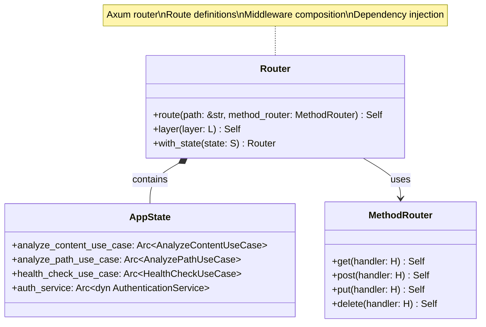
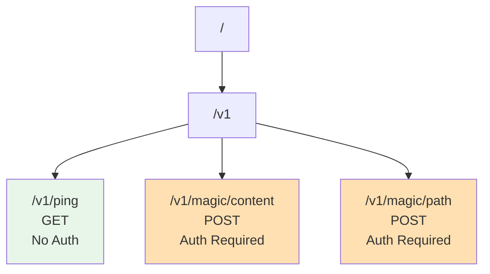
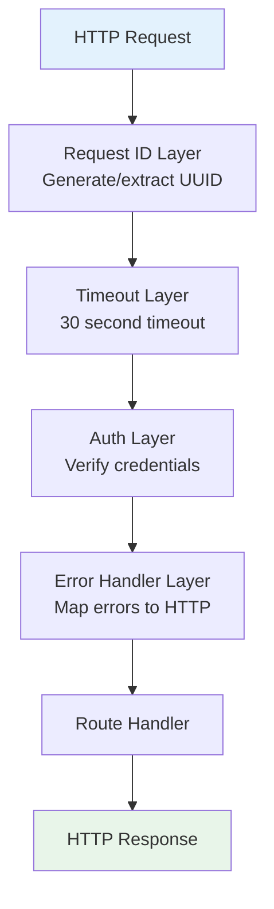
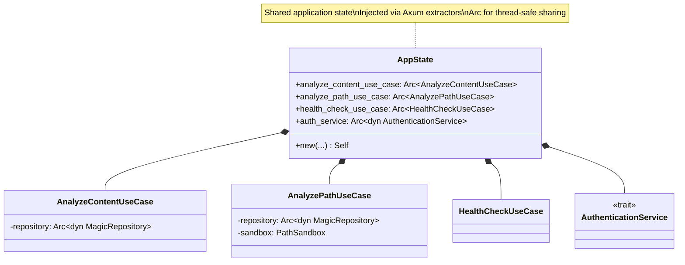
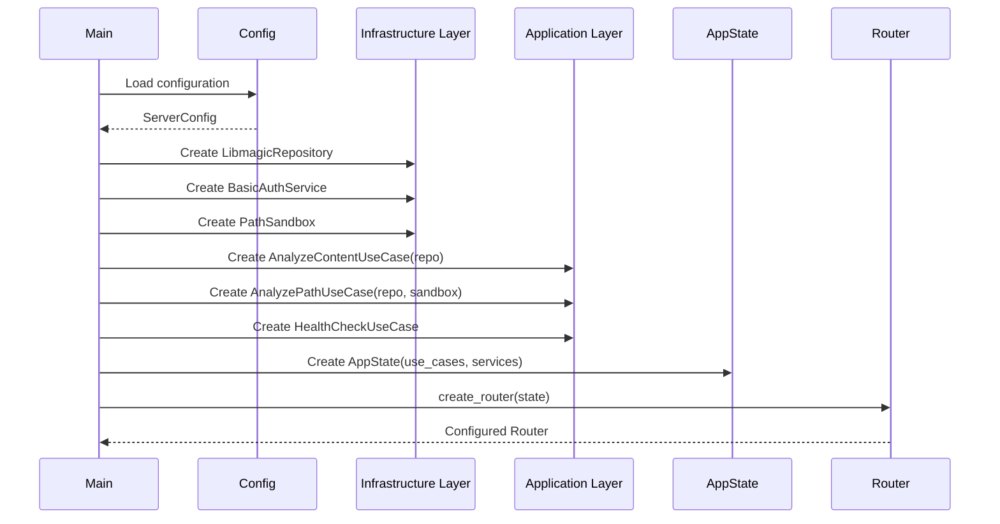
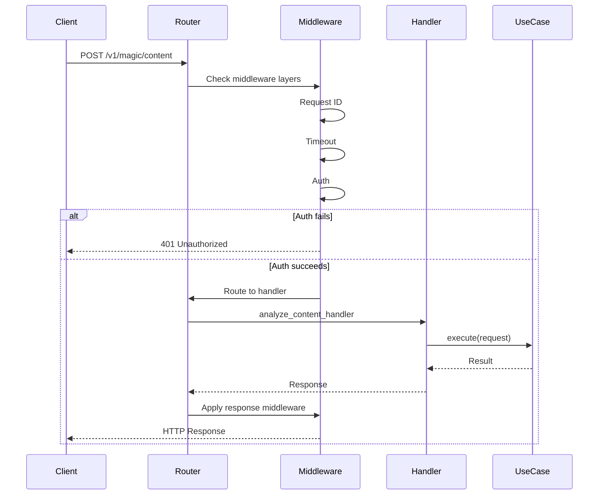

# Router Class Diagram

## Overview

The Axum router configuration defines all HTTP routes, applies middleware layers, and wires dependencies.

## Class Diagram



## Route Configuration



## Route Table

| Path | Method | Auth | Handler | Description |
|------|--------|------|---------|-------------|
| `/v1/ping` | GET | ❌ No | `ping_handler` | Health check / liveness probe |
| `/v1/magic/content` | POST | ✅ Yes | `analyze_content_handler` | Analyze uploaded binary content |
| `/v1/magic/path` | POST | ✅ Yes | `analyze_path_handler` | Analyze file by relative path |

## Middleware Stack



## Router Construction

```rust
pub fn create_router(state: AppState) -> Router {
    Router::new()
        // Health check endpoint (public)
        .route(
            "/v1/ping",
            get(health_handlers::ping_handler)
        )
        
        // Magic analysis endpoints (authenticated)
        .route(
            "/v1/magic/content",
            post(magic_handlers::analyze_content_handler)
        )
        .route(
            "/v1/magic/path",
            post(magic_handlers::analyze_path_handler)
        )
        
        // Apply middleware (in reverse order of execution)
        .layer(error_handler_layer())
        .layer(auth_layer(state.auth_service.clone()))
        .layer(timeout_layer(Duration::from_secs(30)))
        .layer(request_id_layer())
        
        // Inject application state
        .with_state(state)
}
```

## State Management



## Dependency Injection



## Full Router Implementation

```rust
use axum::{
    Router,
    routing::{get, post},
};
use std::sync::Arc;
use std::time::Duration;

pub fn create_router(
    analyze_content_use_case: Arc<AnalyzeContentUseCase>,
    analyze_path_use_case: Arc<AnalyzePathUseCase>,
    health_check_use_case: Arc<HealthCheckUseCase>,
    auth_service: Arc<dyn AuthenticationService>,
) -> Router {
    // Create application state
    let state = AppState {
        analyze_content_use_case,
        analyze_path_use_case,
        health_check_use_case,
        auth_service: auth_service.clone(),
    };
    
    Router::new()
        // Health endpoint (public)
        .route("/v1/ping", get(health_handlers::ping_handler))
        
        // Magic analysis endpoints (authenticated)
        .route("/v1/magic/content", post(magic_handlers::analyze_content_handler))
        .route("/v1/magic/path", post(magic_handlers::analyze_path_handler))
        
        // Middleware layers (applied bottom to top)
        .layer(
            ServiceBuilder::new()
                .layer(HandleErrorLayer::new(handle_error))
                .layer(middleware::from_fn_with_state(
                    auth_service,
                    auth_middleware
                ))
                .layer(TimeoutLayer::new(Duration::from_secs(30)))
                .layer(middleware::from_fn(request_id_middleware))
        )
        
        // Inject state
        .with_state(state)
}
```

## Request Routing Flow



## Server Initialization

```rust
#[tokio::main]
async fn main() -> Result<(), Box<dyn std::error::Error>> {
    // Load configuration
    let config = ServerConfig::from_env()?;
    
    // Initialize infrastructure
    let repository = Arc::new(LibmagicRepository::new()?);
    let auth_service = Arc::new(BasicAuthService::from_env()?);
    let sandbox = PathSandbox::new(&config.sandbox.root_path)?;
    
    // Create use cases
    let analyze_content = Arc::new(AnalyzeContentUseCase::new(repository.clone()));
    let analyze_path = Arc::new(AnalyzePathUseCase::new(repository, sandbox));
    let health_check = Arc::new(HealthCheckUseCase::new());
    
    // Create router
    let app = create_router(
        analyze_content,
        analyze_path,
        health_check,
        auth_service,
    );
    
    // Start server
    let addr = format!("{}:{}", config.server.host, config.server.port);
    let listener = tokio::net::TcpListener::bind(&addr).await?;
    
    println!("Server listening on {}", addr);
    
    axum::serve(listener, app).await?;
    
    Ok(())
}
```

## Testing

```rust
#[cfg(test)]
mod tests {
    use super::*;
    use axum_test::TestServer;
    
    fn create_test_router() -> Router {
        // Create mock dependencies
        let repository = Arc::new(MockMagicRepository::new());
        let auth_service = Arc::new(MockAuthService::new());
        let sandbox = PathSandbox::new("/tmp/test").unwrap();
        
        // Create use cases
        let analyze_content = Arc::new(AnalyzeContentUseCase::new(repository.clone()));
        let analyze_path = Arc::new(AnalyzePathUseCase::new(repository, sandbox));
        let health_check = Arc::new(HealthCheckUseCase::new());
        
        create_router(analyze_content, analyze_path, health_check, auth_service)
    }
    
    #[tokio::test]
    async fn test_health_endpoint() {
        let app = create_test_router();
        let server = TestServer::new(app).unwrap();
        
        let response = server.get("/v1/ping").await;
        
        assert_eq!(response.status(), StatusCode::OK);
    }
    
    #[tokio::test]
    async fn test_auth_required() {
        let app = create_test_router();
        let server = TestServer::new(app).unwrap();
        
        // No auth header
        let response = server
            .post("/v1/magic/content")
            .await;
        
        assert_eq!(response.status(), StatusCode::UNAUTHORIZED);
    }
    
    #[tokio::test]
    async fn test_content_analysis() {
        let app = create_test_router();
        let server = TestServer::new(app).unwrap();
        
        let response = server
            .post("/v1/magic/content?filename=test.pdf")
            .header("authorization", "Basic YWRtaW46cGFzcw==")
            .body(b"PDF data")
            .await;
        
        assert_eq!(response.status(), StatusCode::OK);
    }
}
```

## OpenAPI Integration

```yaml
openapi: 3.0.0
info:
  title: File Magic API
  version: 1.0.0

paths:
  /v1/ping:
    get:
      summary: Health check
      security: []
      responses:
        200:
          description: Service is healthy
          content:
            application/json:
              schema:
                $ref: '#/components/schemas/HealthResponse'
  
  /v1/magic/content:
    post:
      summary: Analyze binary content
      security:
        - basicAuth: []
      parameters:
        - name: filename
          in: query
          required: true
          schema:
            type: string
      requestBody:
        required: true
        content:
          application/octet-stream:
            schema:
              type: string
              format: binary
      responses:
        200:
          description: Analysis successful
          content:
            application/json:
              schema:
                $ref: '#/components/schemas/MagicResponse'
  
  /v1/magic/path:
    post:
      summary: Analyze file by path
      security:
        - basicAuth: []
      requestBody:
        required: true
        content:
          application/json:
            schema:
              $ref: '#/components/schemas/PathRequest'
      responses:
        200:
          description: Analysis successful
        404:
          description: File not found
        403:
          description: Path traversal attempt
```

## Design Rationale

- **Clean Separation**: Routes, middleware, and handlers are clearly separated
- **Dependency Injection**: All dependencies passed via `AppState`
- **Type Safety**: Axum extractors provide compile-time safety
- **Testability**: Easy to create test servers with mock dependencies
- **Composability**: Middleware layers compose cleanly
- **Security**: Authentication middleware applied globally (with public endpoint exceptions)
- **Observability**: Request ID middleware enables distributed tracing
- **Resilience**: Timeout middleware prevents hung requests
